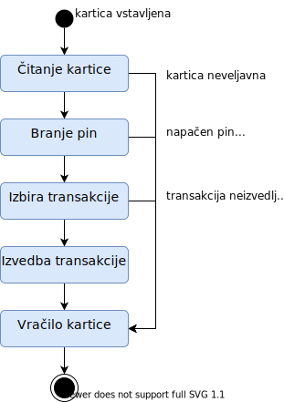

# Unified Modeling Language (UML)

je splošno namenski, ravzvojni, modelirni jezik, ki je primarno usmerjen v razvoj programske opreme. Najbolj efektiven je za delo v skupinah saj poenostavlja komunikacijo med različnimi ljudmi vpletenimi v razvoj (uporabniki, programerji, analitiki, vodstvo, ...).

Primarni namen zanj je standardizacija vizualne notacije za načrtovanje aplikacij, sistemov in poslovnih domen. Služi kot centralni jezik za objektno usmerjen razvoj.

Specifikacija UML 2.5 (in vseh ostalih verzij) je javno dostopna ([link](https://www.omg.org/spec/UML/2.5/PDF)). Vzdržuje in posodablja jo Object Management Group oz. OMG.

UML obsega veliko različnih tipov diagramov, ki jih ločimo na **strukturne diagrame**, ki opisujejo obliko objektov, in **diagrame obnašanj**, ki opisujejo interakcije med njimi.

  
Vir: [Wikipedia](https://en.wikipedia.org/wiki/Unified_Modeling_Language)

## Strukturni diagrami

Strukturni diagrami predstavljajo statični del sistema. Obsežno se uporabljajo v dokumentaciji sistemske arhitekture.

Glavni podkategoriji strukturnih diagramov sta komponentni diagram in razredni diagram.  
Specifično o razrednem diagramu bomo govorili še več v prihodnjih poglavjih.

### Komponentni diagram (_ang. component diagram_)

prikazuje kako so komponente sistema povezane skupaj, da tvorijo vedno večje strukture oz. programske sisteme. Z njimi ilustriramo strukturo arbitrarno kompleksnih sistemov.

Najpogosteje so komponentni diagrami eden najbolj splošnih dokumentov sistema in omogočajo bolj detajlno in hitrejše planiranje implementacije.

Komponente sistema so prikazane kot pravokotniki, ki vsebujejo ime posamezne komponente. Skupaj jih povezujemo s črtkanimi puščicami ali konektorji (glej primer), ki prikazujejo medsebojno odvisnost komponent.

Standard dopušča tudi bolj specifične zapise posameznih komponent, ki predstavijo še osnovne funkcije komponent.

  
Vir: [Wikipedia](https://en.wikipedia.org/wiki/Component_diagram)

Primeri v standardu [poglavje 11.6.5](https://www.omg.org/spec/UML/2.5/PDF#%5B%7B%22num%22%3A703%2C%22gen%22%3A0%7D%2C%7B%22name%22%3A%22XYZ%22%7D%2C114.3%2C626.4%2C0%5D).

### Razredni diagrami (_ang. class diagram_)

opisuje strukturo sistema na nivoju razredov ter njihovig atributov, metod in medsebojnih razmerij.

Predstavlja glaven gradnik objektno usmerjenega modeliranja (_OOM_) in v načrtovalni fazi običajno dopolni do točke, ko je programiranje res samo še stvar implementacije in ne vključuje več pomislekov o strukturi programa.

Objekte na visokem nivoju (npr. v fazi analize oz. _OOA_) predstavimo s pravokotniki, ki vsebujejo ime razredov. Povezujemo jih z različnimi puščicami, ki predstavljajo dedovanje, asociacije in mnogo drugih razmerij.

V bolj natančnih diagramih (npr. v fazi načrtovanja oz. _OOD_), se te pravokotniki razširijo in dopuščajo še zapis atributov in metod razreda.

Prvi primer takega diagrama smo že videli pri delitvi tipov UML diagramov.

Primeri v standardu [poglavje 11.4.5](https://www.omg.org/spec/UML/2.5/PDF#%5B%7B%22num%22%3A657%2C%22gen%22%3A0%7D%2C%7B%22name%22%3A%22XYZ%22%7D%2C114.3%2C161.2%2C0%5D).

## Diagrami obnašanj

Diagrami obnašanj predstavljajo dinamični del sistema. Opisujejo funkcionalnost sistema.

Glavne podkategorije strukturnih diagramov ste diagram aktivnosti, diagram primerov uporabe in diagram stanj.  
Specifično o diagramu primerov uporabe bomo govorili še več v prihodnjih poglavjih.

Poleg tega pa diagrami obnašanj vključujejo še eno skupino diagramov, diagrame interakcij, ki predstavljajo tok kontrolnih sporočil in podatkov med komponentami ali objekti sistema.  
Tu si bomo na hitro ogledali diagram zaporedja.

### Diagram aktivnosti (_ang. activity diagram_)

je grafična reprezenzacija procesa, ki po korakih prikaže aktivnosti v procesu in odločitve, ki vplivajo na potek procesa. Običajno prikazujejo samo tok nadzornih signalov.

Zelo pogosto se taki diagrami pojavljajo tudi v dokumentaciji poslovnih procesov, delovnih operacij, ipd.

  
Vir: [Wikipedia](https://en.wikipedia.org/wiki/Activity_diagram)

Primeri v standardu [poglavje 15.2.5](https://www.omg.org/spec/UML/2.5/PDF#%5B%7B%22num%22%3A1187%2C%22gen%22%3A0%7D%2C%7B%22name%22%3A%22XYZ%22%7D%2C114.3%2C587.3%2C0%5D).

### Diagram primerov uporabe (_ang. use-case diagram_)

je grafični prikaz uporabnikovih interakcij s sistemom. Prikazuje različne primere uporabe sistema in njihove asociacije oz. odvisnosti, ter akterje (uporabnike in zunanje sisteme), ki lahko uporabljajo predstavljene primere.

Najpogosteje ga uporabljamo v fazi analize oz. _OOA_, ker predstavlja funkcionalne zahteve sistema - tj. kaj naj sistem počne in kdo bo z njim opravljal.

Primere uporabe predstavimo z ovalami, ki vsebujejo ime funkcije. Vse funkcije lahko opcijsko obdamo s pravokotnikom, ki predstavlja mejo sistema. Akterji, ki vedno stojijo izven sistema, so narisani kot "stick-man" in imajo pod simbolom ime vloge (obstajajo tudi drugi simboli, ki jih lahko uporabimo). Akterji so direktno povezani s primeri uporabe, ki jih lahko uporabljajo. Medsebojno odvisnost označimo s črtkanimi črtami in nad njimi zapišemo naravo odvisnosti (_extend_ ali _include_).

  
Vir: [Wikipedia](https://en.wikipedia.org/wiki/Use_case_diagram)

### Diagram stanj (_ang. state diagram_)

je podaljšek matematičnega koncepta t.i. avtomata končnih stanj (_ang. finite state machine_). Omogoča grafičen prikaz prehoda med stanji objekta.

Stanja prikažemo z zaobljenimi pravokotniki, ki vsebujejo ime stanja. Povezujemo pa jih s puščicami, ki prikazujejo prehode med stanji. Na puščice običajno zapišemo še pogoj pri katerem pride do prehoda, ali vsaj navedemo posebne primere, kjer pride do vejitve.  
Začetek označimo s polnim krogom, končnec pa z obkroženim polnim krogom.

Nabor simbolov je torej:

Poenostavljen diagram stanj za bankomat, bi torej zgledal nekako tako:

Primeri v standardu [poglavje 14.2.5](https://www.omg.org/spec/UML/2.5/PDF#%5B%7B%22num%22%3A1051%2C%22gen%22%3A0%7D%2C%7B%22name%22%3A%22XYZ%22%7D%2C114.3%2C262.8%2C0%5D).

### Diagram zaporedja (_ang. sequence diagram_)

prikazuje interakcije med objekti sistema, v časovni odvisnosti. Predvsem pa se osredotoča na kontrolna in podatkovna **sporočila** med objekti.

Uporabljamo ga da bolj natančno opišemo specifičen primer uporabe, zato pogosto spremlja diagram primerov uporabe kot bolj specifična definicija.

Sestavljajo ga vertikalne črtkane črte, ki predstavljajo življensko črto objekta (čas teče navzdol po y osi). Na življenskih črtah narišemo pravokotnike, ki predstavljajo aktivnost objekta v celotni izmenjavi sporočil. Med objekti pa nato narišemo puščice s polno črto za kontrolne signale - načeloma na črto zapišemo ime metode (in parametre), ki naj jo izvede drugi objekt. Za podatke pa uporabimo puščice s črtkanimi črtami.

Primer na interakciji email klienta s strežnikom:

  
Vir: [Wikipedia](https://en.wikipedia.org/wiki/Sequence_diagram)

Primeri v standardu [poglavje 17.8.2](https://www.omg.org/spec/UML/2.5/PDF#%5B%7B%22num%22%3A1825%2C%22gen%22%3A0%7D%2C%7B%22name%22%3A%22XYZ%22%7D%2C114.3%2C735.3%2C0%5D).
