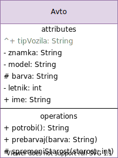
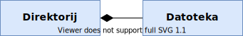
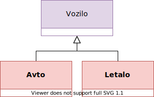
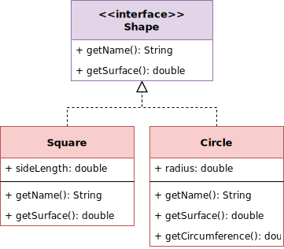

# Razredni diagrami

**Razredni diagrami** (_ang. class diagram_) je tip diagrama, ki prikazuje statično strukturo sistema. Prikazuje nam razrede ter njihove atribute in metode, ki jih poveže v medsebojna razmerja in asociacije.

Predstavlja glavni gradnik objektno usmerjenega modeliranja (_OOM_) in ga načeloma uporabljamo v vseh fazah razvoja sistema. Najprej ga uporabimo za modeliranje koncepta (faza analize), nato ga dopolnemo s podrobnostmi implementacije (faza načrtovanja) in nazadnje ga pretvorimo v dejansko kodo.

Zaradi take dinamike lahko razred prikažemo na dveh nivojih podrobnosti. Prva je preprosto pravokotnik z imenom razreda, druga pa razdeli pravokotnik v tri segmente:

- zgornji segment vsebuje ime razreda, včasih pa še posebne klasifikatorje (v primerih vmesnikov, abstraktnih razredov, ipd.)
- srednji segment navaja atribute razreda, ter običajno označuje tudi njihovo vidljivost (javni, privatni, zaščiteni, ...) in tip
- spodnji segment pa navaja metode, ki jih razred vsebuje - spet običajno označuje njihovo vidljivost in povratni tip

## Člani razreda

Člani razreda so **atributi in metode**.

Tisti člani, ki imajo na začetku simbol `^`, so podedovani iz nadrazredov. Običajno jih obarvamo sivo, da jih v implementaciji ne implementiramo dvakrat in si povzročamo preglavic.

Za člane razreda obstaja kar nekaj modifikatorjev. Spoznali bomo vidljivost in obseg, obstajajo pa še števnost ter specialni (_npr. unique, readOnly, ipd._)

### Vidljivost

Da označimo vidljivost članov razreda, lahko uporabimo enega od sledečih simbolov pred imenom člana:

| Simbol | Vidljivost        |
| :----: | ----------------- |
|  `+`   | public            |
|  `-`   | private           |
|  `#`   | protected         |
|  `~`   | "package private" |

### Obseg

Statični člani (v Javi jih določimo s ključno besedo `static`) se označijo tako, da jih podčrtamo.

To pomeni, da so nepodčrtani člani smatrani v obsegu instance razreda, podčrtani pa v obsegu razreda samega.

## Razmerja

Med razredi poznamo kar nekaj tipov razmerij. Spoznali bomo samo asociacijo in dedovanje, obstajajo pa še odvisnost, implementacija, agregacija in kompozicija.

Na hitro bomo omenili tudi števnost razmerij, ker nam omogoča izdelavo bol podrobnih diagramov.

### Asociacija

V osnovi poznamo eno in dvosmerne asociacije, ki predstavljajo povezavo med razredi.  
Primer: _razred Let in razred Letalo sta sta povezana z dvosmerno asociacijo, ker ima vsak let določeno letalo in vsako letalo določenih več letov_

Asociacijo označimo s **črto**, ki povezuje razreda. Če je **enosmerna**, uporabimo **črto s puščico**.

Poseben primer asociacije je agregacija, kjer več objektov nekega razreda pripada enemu objektu drugega razreda. Simbol za tako asociacijo je sicer drugačen, a mi se bomo držali istega zaradi preprostosti.

#### Agregacija

je **specifičen primer asociacije**, kjer objekt enega razreda lahko lasti objekte drugega razreda (_običajno to pomeni števnost 1 : 1..*_).  
Primer: _objekt razreda Naročilo agregira objekte razreda Izdelek_

Agregacijo označimo s **črto** in **praznim karo/diamantom** na strani razreda, ki agregira.

Iz primera vidimo tudi zanimivo lastnost agregacije - _objekt razreda Motor lahko tekom življenskega cikla pripada različnim objektom razreda Avto_.

#### Kompozicija

je **specifičen primer asociacije**, kjer objekti ki so člani kompozicije ne morejo smiselno obstajati brez starša. Običajni si jo lahko predstavljamo kot razmerje med izdelkom in posameznimi deli - tj. izdelek je kompozicija delov.  
Primer: _razred Človek je kompozicija razredov Roka, Glava, ...; če uničimo objekt razreda Človek, se uničijo tudi objekti, ki so člani kompozicije_

Kompozicijo označimo s **črto** in **polnim karo/diamantom** na strani razreda, ki je kompozicija drugih.

Spet vidimo isto lastnost kot pri agregaciji - _objekt razreda Datoteka lahko tekom življenskega cikla pripada različnim objektom razreda Direktorij_.

### Dedovanje / Generalizacija

Dedovanje ima v razrednem diagramu enak pomen kot v OOP.

Razmerje z dedovanjem oznažimo s **črto** in **prazno puščico**, ki kaže od podrazreda do super/base razreda.

### Realizacija

Realizacija ima enak pomen kot dedovanje, le da se uporablja med vmesnikom (stereotip: `<<interface>>`) in njegovo implementacijo. V Javi se to razmerje označi s ključno besedo `implements`.

Realizacijo označimo s **črtkano črto** in **prazno puščico**, ki kaže proti vmesniku.

### Števnost

Nekatere povezave razredov kot **asociacija** včasih vključujejo števnost.
Naprimer: _Letalu lahko pripada več Letov -> števnost Leta je torej **nič ali več**_ (enosmerna asociacija)

|     Oznaka     | Števnost                |
| :------------: | ----------------------- |
|      `0`       | Ni instance (redko)     |
|     `0..1`     | Nobene ali ena instanca |
| `1` ali `1..1` | Ena instanca            |
| `0..*` ali `*` | Nobene ali več instanc  |
|     `1..*`     | Ena ali več instanc     |
