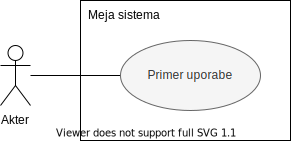

# Diagrami primerov uporabe

**Diagram primerov uporabe** (_ang. use-case diagram_) je grafični prikaz možnih interakcij s sistemom. Prikazuje različne primere uporabe in akterje, ki jih lahko dostopajo.

Ker je diagram primerov uporabe zelo visoko nivojski, ga skoraj vedno spremljajo drugi tipi diagramov, ki bolj natančno opisujejo tako dinamične kot statične aspekte primerov uporabe. Predstavljajo neke vrste posplošen načrt sistema.

Diagrame te vrste sestavljajo trije osnovni gradniki - **primer uporabe**, **akter** in **meja sistema**, ter njihove medsebojne povezave.

## Gradniki

**Primer uporabe** prikažemo z ovalo in predstavlja posamezno enoto funkcionalnosti ali storitev.

**Akterje** prikažemo s figuro človeka (_ang. stick-man_) in predstavlja entiteto, človeško ali ne, ki je izven obsega sistema in z njim interaktira.  
Akterje rišemo na levo in desno stran sistema. Levo običajno rišemo akterje, ki sprožijo primer uporabe, na desno pa akterje, ki se odzovejo ali so vpleteni v izvedbo primera uporabe.

**Meja sistema** ločuje sistem in njegove primere uporabe od zunanjega sveta (tudi akterji). Običajno v levi zgornji kot pravokotnika, ki predstavlja mejo sistema, napišemo ime sistema.

## Razmerja

**Komunikacijsko asociacijo** narišemo kot polno črto med akterja, ki lahko uporablja dani primer uporabe, in primer uporabe. Opcijsko jo lahko tudi poimenujemo, da bolj specifično določimo njen pomen.

**Acosiacijo primera uporabe** narišemo kos črtkano puščico med dvema primeroma uporabe. Pri tej asociaciji pa je obvezno navesti enega izmed dveh stereotipov - **\<\<include\>\>** ali **\<\<extend\>\>**.

- **\<\<include\>\>** pomeni, da se primer uporabe, proti kateremu kaže puščica, izvede vedno, kadar se izvede primer, iz katerega puščica izhaja
- **\<\<extend\>\>** pomeni, da se primer uporabe, iz katerega puščica izhaja, lahko izvede, kadar se izvede primer, proti kateremu kaže puščica

**Generalizacijo** (_poznano tudi kot dedovanje_) narišemo s polno črto in puščico s prazno glavo, ki kaže proti starševski entiteti. Pomeni, da je ena entiteta pod-tip druge (starševske) entitete - tj. lahko uporablja vse primere uporabe svojega starša.

## Primer

  
Vir: [Wikipedia](https://en.wikipedia.org/wiki/Use_case_diagram)
