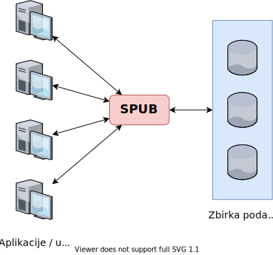
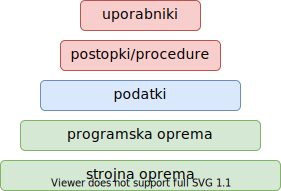

# Sistem za upravljanje podatkovne baze

Kot že omenjeno, je shranjevanje podatkov v preteklosti temeljilo na klasičnih tekstovnih ali binarnih datotekah (_ang. flat file_). Težave so se pojavljale zaradi nepovezanosti podatkov, večih kopij datotek z različnimi vsebinami, posamičnega dostopa, ...  
Zato smo razvili podatkovno usmerjen pristop, pri katerem do podatkov dostopamo preko **sistema za upravljanje podatkovnih baz** - **SPUB** (_ang. Database Management System - **DBMS**_).

**SPUB** je računalniški program, ki povezuje uporabnike, aplikacije in samo bazo podatkov z namenom zajemanja in analiziranja podatkov. Omogoča opredelitev, ustvarjanje, poizvedovanje, spreminjanje in upravljanje z bazami podatkov.  
Vsa manipulacija podatkov poteka na **aplikacijskem nivoju**, tudi prenos iz enega SPUB sistema na drugega, ker običajno niso kompatibilni.

Do posameznega SPUB se lahko dostopa preko standardov, kot sta **vmesnik ODBC** (_ang. Open Database Connectivity_) ali **vmesnik JDBC** (_ang. Java Database Connectivity_). Posledično lahko posamezna aplikacija uporablja več SPUB hkrati, tako da vzpostavi vzporedne povezave.  
Vmesniki so samo komunikacijska plast povezave med aplikacijo in SPUB (kot pri omrežjih), dejanska komunikacija pa poteka v jeziku, ki ga uporablja SPUB - običajno **SQL** (_ang. Structured Query Language_).

Med bolj razširjenimi sistemi za upravljanje relacijskih podatkovnih baz so:

- MySQL
- MariaDB
- PostgreSQL
- Microsoft SQL Server

> Kljub temu, da so relacijske baze podatkov (trenutno) najbolj razširjen tip PB, je vredno omeniti, da obstaja še nekaj takih, ki ne temeljijo na strogo določenih shemah in tebelaričnih povezavah.  
> Popularnost v zadnjih letih hitro pridobivajo **NoSQL** podatkovne baze, kjer poznamo kar nekaj podkategorij:
> 
> - Dokumentna PB (_ang. Document Database_)
> - PB Ključnih vrednosti (_ang. Key-Value Store_)
> - Grafna PB (_ang. Graph Database_)
> - itd.

## Funkcije SPUB

Glavne funckije sodobnega sistema za uprabljanje PB so:

- definiranje, spreminjanje in brisanje opisa PB
- kreiranje PB na podlagi opisa
- definiranje sheme PB in shranjevanje le-te na zunanjem pomnilniku
- vzdrževanje podatkovnega slovarja (informacije o podatkih)
- zagotavljanje podatkovne neodvisnosti
- omogoča uporabnikom in aplikacijam izvedbo osnovnih operacij nad podatki:
  - branje
  - spreminjane
  - dodajanje
  - brisanje
- preprečevanje nenadzorovane redundance
- zaščita podatkov
  - upravljanje z uporabniki
  - identifikacija in avtentikacija uporabnikov
  - nastavljanje dostopnih pravic
- podpora arhiviranju in restavriranju sistema
- zagotavljanje dostopa do podatkov
- izvajanje **transakcij** (_tj. zaporedje ukazov, ki se izvede po principu "vse ali nič"_)
- zagotavljanje integritete podatkov
- sledenje podatkov
- upravljanje in nazdor nad delovanjem podatkovnega sistema

## Komponente SPUB

## Arhitektura SPUB

V osnovi je SPUB sestavljen iz štirih osnovnih modulov:

1. **Uporabniški vmesnik** (_ang. User Interface_)  
   omogoča komunikacijo med uporabnikom in SPUB, namenjen skrbnikom
2. **Procesor poizvedb** (_ang. Query Processor_): **DML** in **DDL** prevajalnika  
   prevzem poizvedb, prevajanje poizvedb v zaporedje zahtevkov po podatkih, običajno se tu izvede še optimizacija
3. **Upravitelj transakcij** (_ang. Transaction Manager_)  
   zaklepa bazo in izvaja transakcije - zaporedja ukazov, ki se izvedejo kot sklop
4. **Upravitelj shranjevanja** (_ang. Storage Manager_)  
   upravlja avtorizacije, datoteke in izravnalnik (_ang. buffer_)

### ACID Skladnost

ACID je princip izvajanja transakcij, ki zagotavlja štiri lastnosti podatkovne baze: **atomarnost**, **konsistentnost**, **izolacijo** in **trajnost**.

- **ATOMARNOST**:
  - transakcija se mora izvesti v celoti apli pa sploh ne
  - postopek je sledeč: SPUB hrani dnevnik izvedenih akcij in v primeru napake s pomočjo le-tega razveljavi celotno transakcijo
- **KONSISTENTNOST**:
  - transakcija spreminja stanje podatkovne baze in je veljavna le če upošteva vse integritetne omejitve PB
  - v primeru da stanje po izvedbi transakcije ni veljavno, se transakcija zavrne v celoti
- **IZOLACIJA**:
  - rezultat je viden ostalim odjemalcem, šele ko se transakcija izvrši v celoti
  - operacije ene transakcije ne vplivajo na druge transakcije
- **TRAJNOST**:
  - rezultati uspešne transakcije so trajno shranjeni in dostopni, tudi če se sistem takoj po izvedbi poruši

## Kaj sledi?

organizacija SPUB (centralizirana / distribuirana, uporabniki in vloge, varovanje), varovanje SPUB in PB
